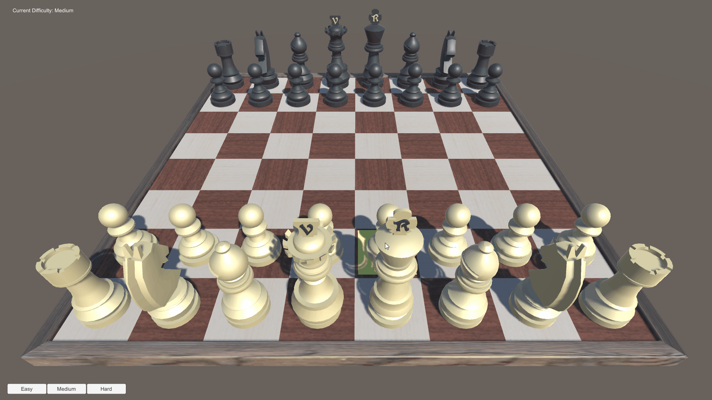

# Chess-AI
A Chess AI created in Unity using the MiniMax algorithm, with an option to adjust the difficulty of the AI.

Disclaimer - Original chess game is not my own and can be found here:

https://www.raywenderlich.com/5441-how-to-make-a-chess-game-with-unity#toc-anchor-009

This framework has been modified to implement the AI (can be seen where there are comments with my name). Custom scripts that have been created for the AI can be found in Assets > Scripts > CustomScripts.

## Visual Demo

## Controls
Difficulty can only be adjusted before the first turn has been taken.

**Select Chess Piece** - LMB

**Deselect Chess Piece** - RMB

**Move Chess Piece** - LMB on tile visual displayed on the chess board (only visible if piece has the ability to move - depending on the game state).

## MiniMax Algorithm
The MiniMax algorithm works by using a tree to map the current game's state, and evaluate the most efficient move to be made, by recursively breaking down each possible move, and then scoring the board state.

A specified depth is used to represent how many turns the algorithm can 'think' ahead, before evaluating each board state. As the game tree grows, the better moves the algorithm can make, at the cost of the number of moves generated exponentially growing.

### Evaluation Function
A core concept of the MiniMax algorithm is how it evaluates a board state, and how a score is generated to reflect this. For this project, the following are used for evaluation:

**Number of pieces on board** - Each game piece is given a value - i.e. Pawns being given a small numerical value when compared against the King. All pieces on the board are then counted, giving a total score.

**Piece position evaluation** - Specific pieces perform better at certain board positions. If a piece is in an optimal position, it will have a positive impact on it's score.

### Alpha Beta Pruning
The process of fine-tuning the MiniMax algorithm, to reduce the number of game moves being evaluated, by instantly disregarding moves which are a worse move than the current ones explored.

This pruning technique works by storing values *alpha* and *beta*, which stores the current maximum and minimum values at the current search depth or higher. These values are then used in a condition for each recursive call, where if the condition is met (*beta* <= *alpha*), then no further calls in that branch are made.

### Move Ordering
A potential issue with Alpha-Beta Pruning revolves around the order in which moves are evaluated.

In a worst-case scenario, if moves are ordered from worst to best, all moves would still need to be evaluated - leading to no saving in time. This would also result in worse performance than if Alpha-Beta pruning was not used, as both Alpha and Beta variables need to be stored.

To counter the outlined issue above, Move Ordering can be utilised to evaluate moves that look most promising first.

This operates by calling the evaluation function for each board move, then sorting based on the evaluation,  so that most promising game states are explored first.

## Future Improvements

**Detailed Piece Position Evaluations**: 

As outlined in [Evaluation Function](#evaluation-function), currently each piece has a single array to evaluate whether it's position is optimal. However, in reality, different positions at different stages in the game are more advantagous, so a future step to improving the AI could be to dynamically change the board scoring throughout the game - instead of just a single static value.

**Difficulty Adjustments**: 

The only way the player can currently adjust the AI difficulty is through what depth the MiniMax algorithm searches to, through an explicit button press.

An interesting idea could be to use dynamically adjusting difficulty, where MiniMax is used for both the AI and human player, storing the human player's top 3 promising moves. This could be integrated into Fuzzy Logic, where depending on what move the human player chooses to make, a score could be mapped on a curve - where specific boundaries respond to specific difficulties.

This could then be enhanced using Zadeh operators, to consider other factors, i.e. time taken to move - further enhancing the player experience.